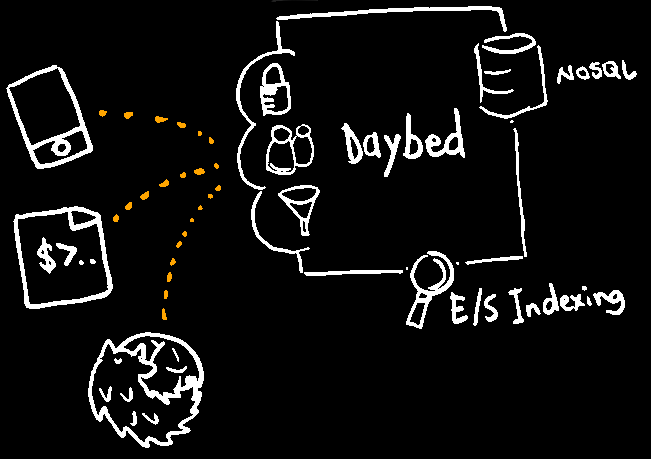
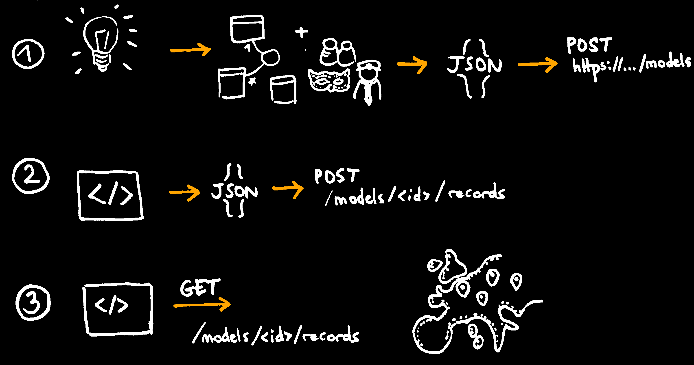

.. |br| raw:: html

    

Daybed
======

→ *spatial* storage as a service !

.. image :: media/front-rest-daybed.png

----

* Mathieu Leplatre *(@leplatrem)*
* PostGIS and Leaflet enthusiast *(training, plugins, Django apps)*
* JavaScript and Python dev *(freshman at Mozilla)*

http://leplatrem.github.io/slides/201501-fosdem/

.. notes::

    Talk about background : IT services company, building spatial apps.

    Build small prototypes quickly to bait customers :)

    Almost always storing lat/lng with attributes.

----

How would you build... ?
========================

.. notes::

    Ask the audience about their strategy when they need to store spatial data,
    like tracking pictures of a specific flower.
    Ask what happens when another app with other specific fields comes up,
    like for bar terrasses.

----

Usually, you implement and deploy a backend...

.. image :: media/no-dev-backend-1.png

----

With Daybed, you just plug your app !

.. image :: media/no-dev-backend-2.png

----

Why Daybed ?
============

* Build collaborative apps |br| *(basic, spatial, encrypted, ...)*
* Build a Google Forms alternative |br| *(form → model, submission → record)*
* Do not reinvent the wheel |br| *(JavaScript app without API dev)*
* Prototype Web applications |br| *(Frontend-dev only)*

----

Daybed is not...
================

* Another DBMS *(too naive)*
* A framework *(client agnostic)*
* The golden hammer *(not everything is a nail)*
* A company with a business plan

----

Daybed is...
============

----

A simple REST API... for any HTTP client!

* Open source *(BSD)*

----

That you deploy once!

.. image :: media/deploy-once.png

----

And use intuitively...

----

Under the hood
==============

* **Pyramid**, a robust and powerful python Web framework
* **Cornice**, a REST framework for Pyramid
* **Colander** for the schema validation part
* **Redis** as the default persistence backend |br| *(or CouchDB)*
* **ElasticSearch** as indexing and faceted search engine *(pluggable)*

----

Key features
============

* Record validation *(from model schema)*
* Authentication *(Hawk tokens)*
* Permissions *(CRUD, by author etc.)*
* Simple model relations

----

Spatial features
================

* Geometries field types |br| *(point, lines, polygons, geojson...)*
* GeoJSON content type *(feature collection)*
* Spatial indexing *(bounding box, distance, ...)*

----

Model definition
================

* Model id
* List of fields *(int, string, relations, ...)*
* List of permissions

→ REST endpoints ``/models/<id>/definition`` |br| ``/models/<id>/records``

----

Permissions
===========

* Creator of model has full permissions

Optional matrix, by model:

* userid, anonymous, authenticated
* create, read (all|own), update (all|own) delete (all|own)
* (read|modify|delete) model definition

----

Daybed.js
=========

* Wrap HTTP requests
* Bring promises *(with polyfill)*
* Authentication tokens *(Hawk signing)*
* Helpers for sharing/syncing

.. code-block :: html

    

----

Getting started
===============

.. code-block :: javascript

    var definition = {
      title: 'FOSDEM',
      description: 'Simple locations',
      fields : [
        {name: 'location', type: 'point'},
        {name: 'label', type: 'string'},
      ]
    };

    var permissions = {
      'Everyone': ['create_record', 'read_all_records',
                   'update_all_records', 'delete_all_records']
    };

* `All available field types <http://daybed.readthedocs.org/en/latest/fieldtypes.html>`_.
* `Permissions documentation <http://daybed.readthedocs.org/en/latest/permissions.html#models-permissions>`_.

----

Getting started
===============

.. code-block :: javascript

    var model = {
      definition: definition,
      permissions: permissions
    };

    var server = 'https://daybed.io';
    var modelId = 'a-simple-location-model-with-label';

    Daybed.startSession(server)
      .then(function (session) {
        return session.saveModel(modelId, model);
      });

----

Load records
============

* Default format is JSON
* GeoJSON feature collection renderer |br| *(Accept header)*

.. code-block :: javascript

    var session = new Daybed.Session(server);

    session.getRecords(modelId, {
        format: 'application/vnd.geo+json',
      })
      .then(function (geojson) {
        L.geoJson(geojson).addTo(map);
      });

----

Create records
==============

* POST data
* Validated against model schema
* Obtain record id
.. code-block :: javascript

    map.on('dblclick', function(e) {
      // LatLng to [x, y]
      var point = [e.latlng.lng, e.latlng.lat];

      session.saveRecord(modelId, {
          label: 'Building',
          location: point
        })
        .then(function(record) {
          var layer = L.marker(e.latlng).addTo(map);
          // Keep record id
          layer._recordId = record.id;
        });
    });

----

Modify and delete
=================

* For example, delete on marker click:

.. code-block :: javascript

    layer.on('click', function () {
      // Using record id
      session.deleteRecord(model, layer._recordId)
        .then(function () {
          map.removeLayer(layer);
        });
    });

* RESTful verbs *(PUT, PATCH, DELETE)*
* ``session.deleteRecord(modelId, id)`` |br| ``session.saveRecord(modelId, record)``

----

Demo
====

* http://js.daybed.io/examples/leaflet/

.. raw:: html

    <video src="media/collaborative-map.webm" autoplay loop>

----

Share authentication token
==========================

* Shared token → collaborative app!

For example, via URL hash:

.. code-block :: javascript

    var token = window.location.hash.slice(1);

    Daybed.startSession(server, {token: token})
      .then(function (session) {
        window.location.hash = session.token;
      })
      .catch(function (e) {
        console.error("Could not start session", e);
      });

.. image :: media/location-token.png

----

Lookup records
==============

* E/S mappings are generated from model definitions
* Records are indexed on creation
* Every basic geometric types
* Operators on BBox, distance
* Geo point aggregates *(a.k.a. clustering)* via `plugin <https://github.com/zenobase/geocluster-facet>`_

The best Web companion !

* Sorts, paginates, aggregates, counts
* Scales — Insanely fast — Ubiquitous

----

Bounding box search
===================

* Build queries in JSON !

.. code-block :: javascript

    var query = {
      ...
        filter: { geo_bounding_box : {
            location: {
              top: bbox.getNorthWest().lat, left: bbox.getNorthWest().lng,
              bottom: bbox.getSouthEast().lat, right: bbox.getSouthEast().lng
            }
          } }
      ...
    };

    session.searchRecords(modelId, query)
      .then(function (response) {
        alert(response.hits.hits.length + ' results!');
      });

* `ElasticSearch Query DSL <http://www.elasticsearch.org/guide/en/elasticsearch/reference/current/query-dsl-geo-bounding-box-filter.html#query-dsl-geo-bounding-box-filter>`_

----

Demo
====

* http://js.daybed.io/examples/search-extent/

.. raw:: html

    <video src="media/search-extent.webm" autoplay loop>

----

Conclusion
==========

----

Generic API means...
====================

* No effort on backend *(quick start)*
* Logic-less API *(very basic rules)*
* Easier with schemaless database |br| *(...or PostgreSQL json!)*

* More work on the client *(computation, conflicts)*

→ Daybed on server + `Turf.js <http://turfjs.org>`_ on client ?

----

About your use-case ?
=====================

* Deploy one backend! Roll out many applications!

→ Think twice before implementing a custom backend!

http://daybed.rtfd.org — https://daybed.io/v1/

----

Some ideas...
=============

* `Form builder <https://github.com/spiral-project/formbuilder>`_
* Websockets / SimplePush
* Precondition headers
* A bit more HATEOAS

See also

* `postgrest <https://github.com/begriffs/postgrest>`_ *(PostgreSQL as API, Haskell)*
* `Eve <http://python-eve.org>`_ *(build generic APIs, Python)*
